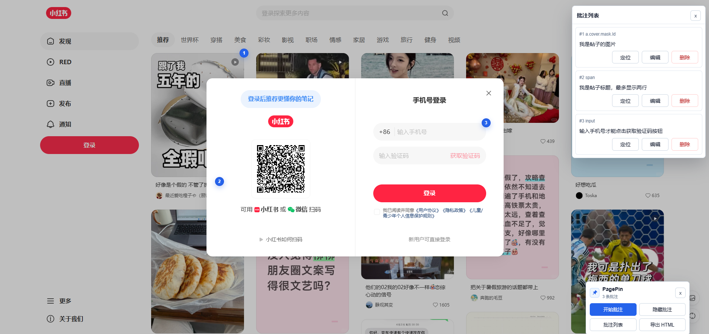

# PagePin User Manual

[中文手册](manual.zh-CN.md)

---

## Part 1 — Adding Annotations (Editor)

> 1Use case: Open an HTML page in the browser, use the PagePin extension to annotate elements, and export a self-contained annotated HTML file.

### 1. Prerequisites

- PagePin extension installed in Chrome or Edge.
- Target HTML page open in the browser.
- For local `file://` pages: enable **Allow access to file URLs** in the extension details page.

### 2. Open the Tool Menu

Click the PagePin icon in the browser toolbar. A floating menu appears at the bottom-right of the page.

> **Draggable:** hold the title bar (the pushpin icon and "PagePin / N annotations") and drag the menu anywhere to avoid blocking page content.

| Button | Action |
|--------|--------|
| 开始批注 (Start) | Enter element-picker mode |
| 隐藏批注 / 显示批注 (Hide / Show) | Toggle all annotation icons |
| 批注列表 (List) | Open the annotation list panel |
| 导出 HTML (Export) | Download a self-contained annotated HTML file |

### 3. Add an Annotation

1. Click **开始批注** in the menu.
2. The page enters picker mode — elements highlight with a blue border on hover.
3. Click the target element. A remark dialog opens.
4. Type your remark and click **保存** (Save), or press Ctrl+Enter.
5. A numbered icon (e.g. ①) appears at the top-right corner of the element.

> Press Esc to cancel picker mode.

> Clicking the blank area outside the dialog does not close it, so you won't lose typed text by accident; use **Cancel** or Esc to close it.

### 4. Edit / Delete an Annotation

- **Click the numbered icon** to open the remark dialog. Modify the text and save, or click **删除** (Delete) to remove it.
- After deletion, subsequent annotation numbers automatically decrement — no gaps.

### 5. Annotation List

Click **批注列表** in the menu. A panel opens at the top-right listing all annotations by number.

> The list panel renders above all numbered icons and can be dragged by its header (title bar) to any position, so it never blocks page content; with many annotations, scroll inside the list.

Each entry shows:
- Sequence number + target element label (e.g. `#1 button.submit`)
- Annotation text
- Three action buttons

| Button | Action |
|--------|--------|
| 定位 (Locate) | Scroll to the element and flash a highlight |
| 编辑 (Edit) | Open the remark dialog |
| 删除 (Delete) | Remove the annotation |

Target element status:
- Element label shown → visible, all actions available
- **（已隐藏）** (hidden) → element exists in DOM but is not visible (e.g. inside a closed page popup); locate and edit still work
- **目标元素已丢失** (lost) → element removed from DOM; only delete is available

### 6. Annotating Elements Inside Page Popups

If the annotation target is inside a page-level popup (modal, dropdown panel, etc.):

- When the popup closes, the annotation icon hides automatically.
- When the popup reopens, the icon reappears automatically — the annotation is not lost.
- In the annotation list, the entry shows **（已隐藏）** while the popup is closed, and returns to normal when it reopens.

### 7. Export

1. Click **导出 HTML** in the menu.
2. The browser shows a "Save As" dialog. Default filename: `original-name.annotated.html`.
3. The saved file is fully self-contained — all annotation data and the viewer script are embedded.

> The exported file can be viewed without the extension, and can also be reopened with the extension for further editing. Annotations added or edited after reopening are likewise auto-saved to local storage keyed by page URL, surviving refreshes and reopens until the next successful export.

> After a successful export, the annotations on the current page are cleared automatically (they are fully written into the exported file). See the next section.

### 8. Auto-Save and Clearing

- Annotations are saved automatically to local browser storage, keyed by page URL (hash stripped). No manual step needed.
- If you accidentally click away to another page, reload, or even close the tab mid-annotation, nothing is lost: reopen the page and your annotations are restored automatically.
- Annotations persist until **Export HTML** succeeds: after a successful export, both the on-page annotations and the locally saved copy are cleared, so the next round starts clean.

> Auto-restore covers local `file://` pages (requires "Allow access to file URLs", which is already a prerequisite) and `localhost` / `127.0.0.1` dev-server pages. On other http(s) pages the extension requests no all-sites permission, so after a reload click the extension icon to restore annotations.

---

## Part 2 — Viewing Annotations (Reader)

> Use case: You received an exported `.annotated.html` file and want to read the annotations. No extension required.

### 1. Open the File

Open the `.annotated.html` file in any browser. A viewer toolbar appears at the bottom-right automatically.

> **Draggable:** hold the pushpin icon on the left side of the toolbar to reposition it.

| Element | Action |
|---------|--------|
| N 条批注 | Total annotation count |
| 隐藏 / 显示 (Hide / Show) | Toggle all annotation icons |
| 批注列表 (List) | Open the annotation list panel |

### 2. View via Numbered Icons

- Annotated elements display numbered icons (①②③…) at their top-right corner.
- Click an icon to open a small popup showing the annotation number and text.
- Long remarks scroll inside the popup.
- Click **x** on the popup to close it.

### 3. View via Annotation List

Click **批注列表** on the toolbar. A panel opens at the top-right listing all annotations.

> The list panel renders above all numbered icons and can be dragged by its header (title bar) to any position, scrolling inside the list when there are many annotations; the annotation popup opened by clicking a number renders above the list panel.

Each entry shows:
- Sequence number + target element label
- Annotation text
- **定位** (Locate) button: scrolls to the element and flashes a blue highlight for ~1 second

Target element status:
- Normal → locate available
- **（已隐藏）** → element exists but is not visible (e.g. inside a collapsed section)
- **目标元素已丢失** → element not present; locate unavailable

### 4. Annotations Inside Page Popups

If an annotation targets an element inside a page popup:

- While the popup is closed, the icon is hidden and the list shows **（已隐藏）**.
- After opening the popup, the icon reappears and the list status updates automatically.
- You can then view or locate the annotation as normal.

---

## FAQ

**Q: Clicking the extension icon does nothing.**
A: Chrome/Edge internal pages (`chrome://`, extension store, etc.) block script injection. Use a regular HTML page. For local files, enable "Allow access to file URLs" in the extension details.

**Q: No annotations visible after opening the exported file.**
A: Make sure you opened the `.annotated.html` file, not the original HTML. Only the exported file contains embedded annotation data.

**Q: I accidentally clicked away to another page while annotating. Are my annotations lost?**
A: No. Annotations are saved automatically to local browser storage keyed by page URL. Local `file://` pages and `localhost` / `127.0.0.1` dev-server pages restore automatically on reload or reopen; on other http(s) pages, click the extension icon after a reload to restore. They are only cleared after a successful HTML export.

**Q: The annotation list shows "目标元素已丢失" (element lost).**
A: The target HTML element no longer exists on the page. If the page has dynamic popups, try opening the relevant popup first. If the element was truly removed, you can only delete that annotation.

